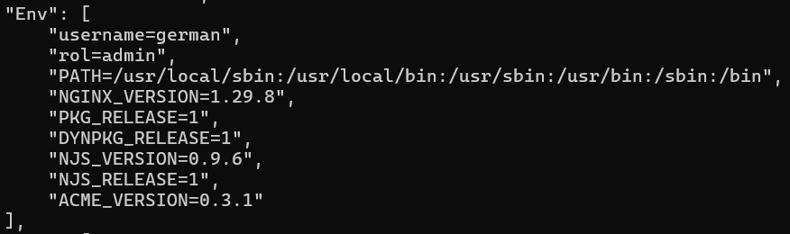

# Variables de Entorno
### ¿Qué son las variables de entorno?

```
Es un valor dinámico y configurable almacenado en el sistema operativo que influye en el comportamiento de los procesos en ejecución.
```

### Para crear un contenedor con variables de entorno

```
docker run -d --name <nombre contenedor> -e <nombre variable1>=<valor1> -e <nombre variable2>=<valor2>
```

### Crear un contenedor a partir de la imagen de nginx:alpine con las siguientes variables de entorno: username y role. Para la variable de entorno rol asignar el valor admin.

```
docker run -d --name srv-web4 -e username=german -e role=admin nginx:alpine
```

# CAPTURA CON LA COMPROBACIÓN DE LA CREACIÓN DE LAS VARIABLES DE ENTORNO DEL CONTENEDOR ANTERIOR


### Crear un contenedor con la imagen de mysql, mapear todos los puertos

```
docker run -P -d --name srv-mysql mysql 
```

### ¿El contenedor se está ejecutando?

```
No se esta ejecutando el contenedor
```

### Identificar el problema

```
docker logs srv-mysql
```

### Para crear un contenedor con variables de entorno especificadas
- Portabilidad: Las aplicaciones se vuelven más portátiles y pueden ser desplegadas en diferentes entornos (desarrollo, pruebas, producción) simplemente cambiando el archivo de variables de entorno.
- Centralización: Todas las configuraciones importantes se centralizan en un solo lugar, lo que facilita la gestión y auditoría de las configuraciones.
- Consistencia: Asegura que todos los miembros del equipo de desarrollo o los entornos de despliegue utilicen las mismas configuraciones.
- Evitar Exposición en el Código: Mantener variables sensibles como contraseñas, claves API, y tokens fuera del código fuente reduce el riesgo de exposición accidental a través del control de versiones.
- Control de Acceso: Los archivos de variables de entorno pueden ser gestionados con permisos específicos, limitando quién puede ver o modificar la configuración sensible.

### ¿Qué bases de datos existen en el contenedor creado?

```
information_schema   |  
| mysql              |
| performance_schema |
| sys                |
```
