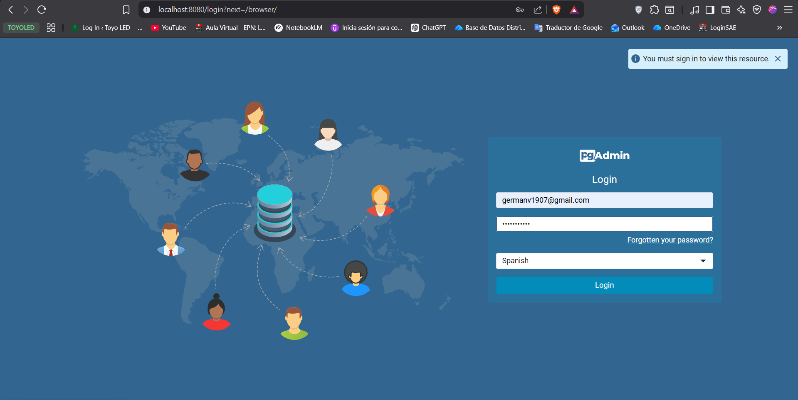
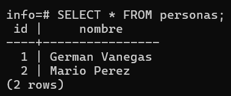

### Crear contenedor de Postgres sin que exponga los puertos. Usar la imagen: postgres:15-alpine3.21

```
docker run -d --name srv-postgres -e PASSWORD_POSTGRES=postgres123 postgres
```

### Crear un cliente de postgres. Usar la imagen: dpage/pgadmin4

```
docker run -d --name srv-clientePostgres -p 8080:80 -e PGADMIN_DEFAULT_EMAIL=germanv1907@gmail.com -e PGADMIN_DEFAULT_PASSWORD=postgres123 dpage/pgadmin4
```

La figura presenta el esquema creado en donde los puertos son:
- a: (8080)
- b: (80)
- c: (5432)


## Desde el cliente
### Acceder desde el cliente al servidor postgres creado.
# COMPLETAR CON UNA CAPTURA DEL LOGIN

### Crear la base de datos info, y dentro de esa base la tabla personas, con id (serial) y nombre (varchar), agregar un par de registros en la tabla, obligatorio incluir su nombre.

## Desde el servidor postgresl
### Acceder al servidor
### Conectarse a la base de datos info

```
docker exec -it srv-postgres psql -U postgres -d info
```

### Realizar un select *from personas
# AGREGAR UNA CAPTURA DE PANTALLA DEL RESULTADO

