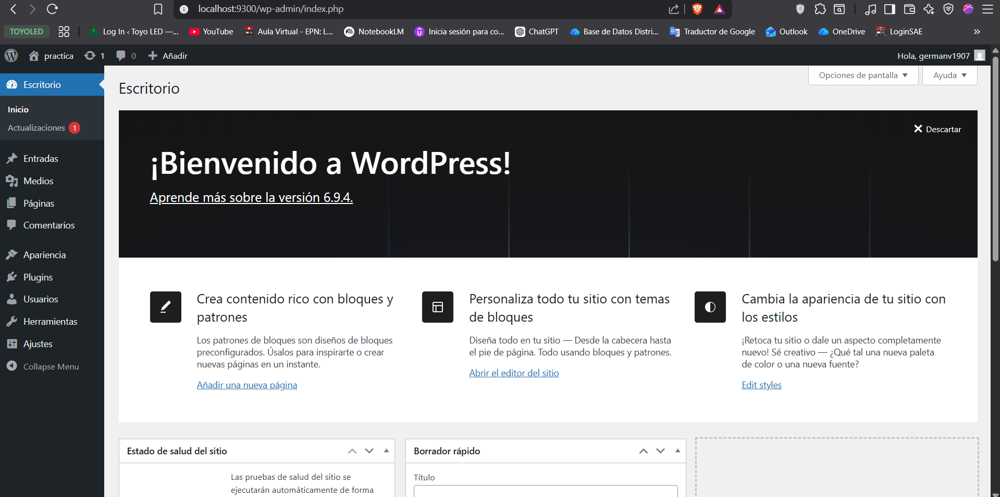

## Esquema para el ejercicio


### Crear la red

```
docker network create red-wordpress
```

### Crear el contenedor mysql a partir de la imagen mysql:8, configurar las variables de entorno necesarias

```
docker run -d --name servidor-mysql --network red-wordpress -e MYSQL_ROOT_PASSWORD=secreta123 -e MYSQL_DATABASE=wordpress_db -e MYSQL_USER=usuario_wp -e MYSQL_PASSWORD=clave_wp mysql:8
```

### Crear el contenedor wordpress a partir de la imagen: wordpress, configurar las variables de entorno necesarias

```
docker run -d --name app-wordpress --network red-wordpress -p 9300:80 -e WORDPRESS_DB_HOST=servidor-mysql:3306 -e WORDPRESS_DB_USER=usuario_wp -e WORDPRESS_DB_PASSWORD=clave_wp -e WORDPRESS_DB_NAME=wordpress_db wordpress
```

De acuerdo con el trabajo realizado, en el esquema del ejercicio el puerto a es **(9300:80)**

Ingresar desde el navegador al wordpress y finalizar la configuración de instalación.
# COLOCAR UNA CAPTURA DE LA CONFIGURACIÓN

Desde el panel de admin: cambiar el tema y crear una nueva publicación.
Ingresar a: http://localhost:9300/ 
recordar que a es el puerto que usó para el mapeo con wordpress
# COLOCAR UNA CAPTURA DEL SITO EN DONDE SEA VISIBLE LA PUBLICACIÓN.


### Eliminar el contenedor wordpress

```
docker rm app-wordpress
```

### Crear nuevamente el contenedor wordpress
Ingresar a: http://localhost:9300/ 
recordar que a es el puerto que usó para el mapeo con wordpress

### ¿Qué ha sucedido, qué puede observar?

```
Se puede observar que la publicación que creamos sigue existiendo, no se ha perdido. Tampoco nos pide volver a instalar WordPress desde cero.
```
